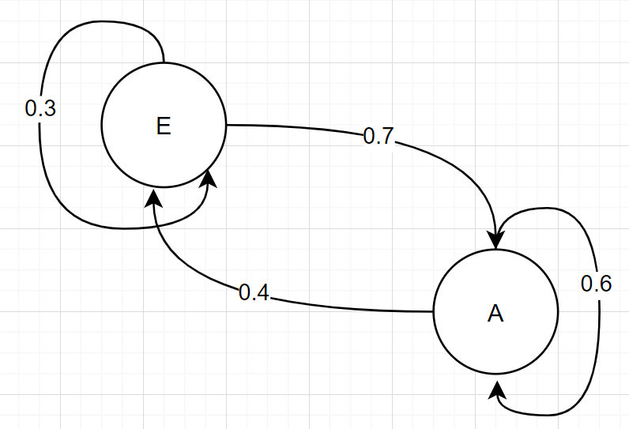
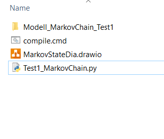

# MarkovChain to Code

Markovketten beschreiben abfolgen von Warscheinlichkeiten und Zuständen.
In diesem Projekt überstzen wir eine Visuelle Markovkette in Quellcode.

## Inhaltsverzeichniss

1. [Quickstart](#quickstart)
2. [FuncDoc](Doc/FuncDoc.md)
3. [Exampels](...)

## Quickstart

Wir beginnen mit der folgenden **Markovkette**, welche wir in **drawio**
erstellen und lokal abspeichern.

Diese Kette hat Zwei Zustände **E** und **A** beide können über 
Pfeile mit einer gewissen Warscheinlichkeit erreicht werden.

*****************
Um das Digramm in **Code** zu übersetzen führen wir den folgenden Konsolenbefehl

    .\MarkovToCode.py MarkovStateDia.drawio Test1

Der erste Argument ist der Name des **drawio files** , das zweite 
steht für den Namen des Diagramms.
******
Es werden die folgenden Files erzeugt: 

* **Modell_MarkovChain_Test1** hier ist die Warscheinlichkeits Matrix gespeichert. Das Format ist **.pkl**
* **Test1_MarkovChain.py** Hier werden Funktion für die Warscheinlichkeits Matrix bereitgestellt.

********
Um das Modell zu nutzen erstellen wir das folgenden **Python-Skript**

    from Test1_MarkovChain import *

    Matrix=LoadModell_MarkovChain_Test1()

    mu=[1,0]

    [States,mu]=CallMarkovChain_Test1(mu,Matrix)

    print([States,mu])

In der ersten Zeile importieren wir alle funktion aus **Test1_MarkovChain.py**.

Die folgende Funktionen stehen zu verfügung: 

* **LoadModell_MarkovChain_Test1** hier wird die Matrix geladen
* **CallMarkovChain_Test1(mu,Matrix)** Ruft die Kette auf und speichert das Ergebniss in dem Vektor **mu,States**

Der **Output** ist :

    [['E', 'A'], [0.3, 0.7]]

Das heißt der nächste Zustand ist **A** mit einer Warscheinlichkeit von **70%**

## Literatur

[1] : **Maschienelles Lernen , Ethem Alpaydin**